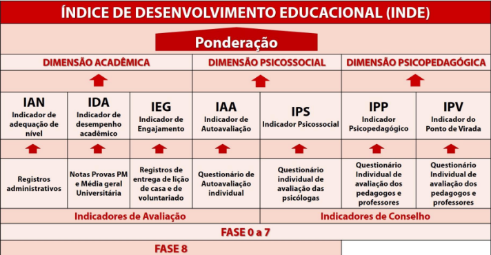
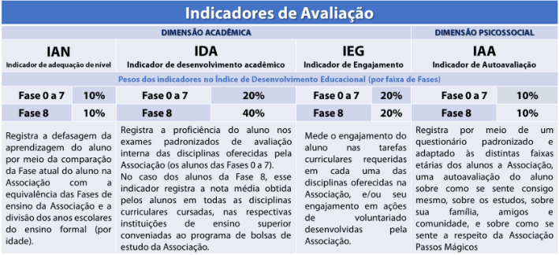
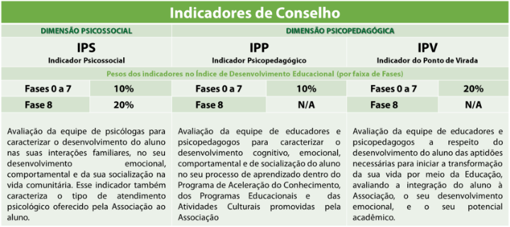
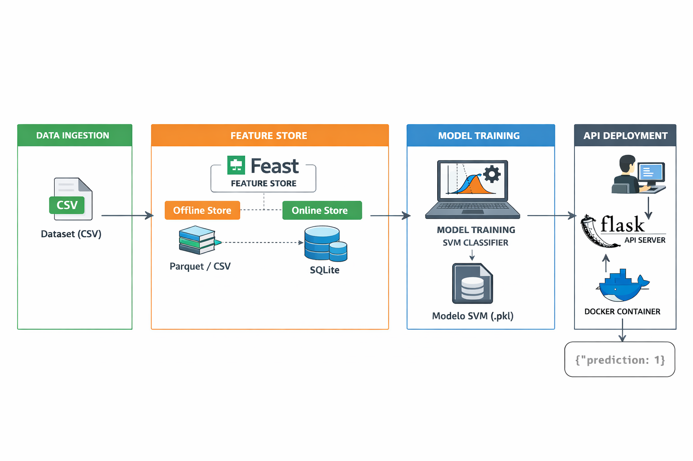

# Tech Challenge 05 MLET

Pipeline completo de Machine Learning para predição de **defasagem educacional**, utilizando:

- **Feast** → Feature Store
- **Scikit-learn (SVM)** → Modelo de classificação
- **Flask** → API de inferência
- **Docker** → Containerização
- **GitHub Actions** → CI/CD

O sistema treina um modelo para prever a **chance de defasagem** a partir de indicadores educacionais, conforme imagens abaixo:

---

---

As features utilizadas são:

- INDE - Índice de desenvolvimento educacional
- IDADE - Idade do aluno
- IAA - Indicador de autoavaliação
- IEG - Indicador de engajamento
- IPS - Indicador psicossocial
- IPP - Indicador psicopedagógico
- IDA - Indicador de desenvolvimento acadêmico
- IPV - Indicador de ponto de virada

Maiores detalhes sobre as features, seleção, treinamento e validação do modelo no arquivo TC05_Final.ipynb

---

# Arquitetura

---

# Instalação
git clone https://github.com/carlos-moreiragit/TC05.git
cd TC05
python -m venv venv
source venv/bin/activate
cd src
pip install -r requirements.txt

## Criar a Feature Store
python features.py

## Treinar o Modelo
svm_train_pipeline.py

## Executar a API
python api.py

# Rodar em Docker
docker build -t tc05 .
docker run -p 5000:5000 tc05

## Dockercompose
docker-compose up --build

